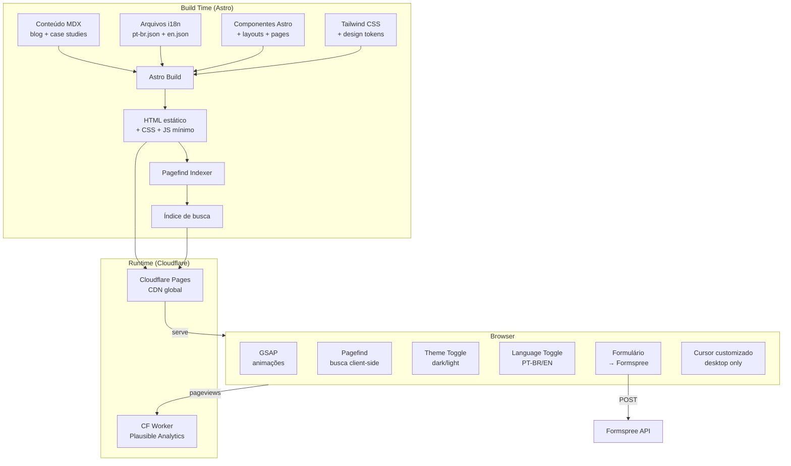
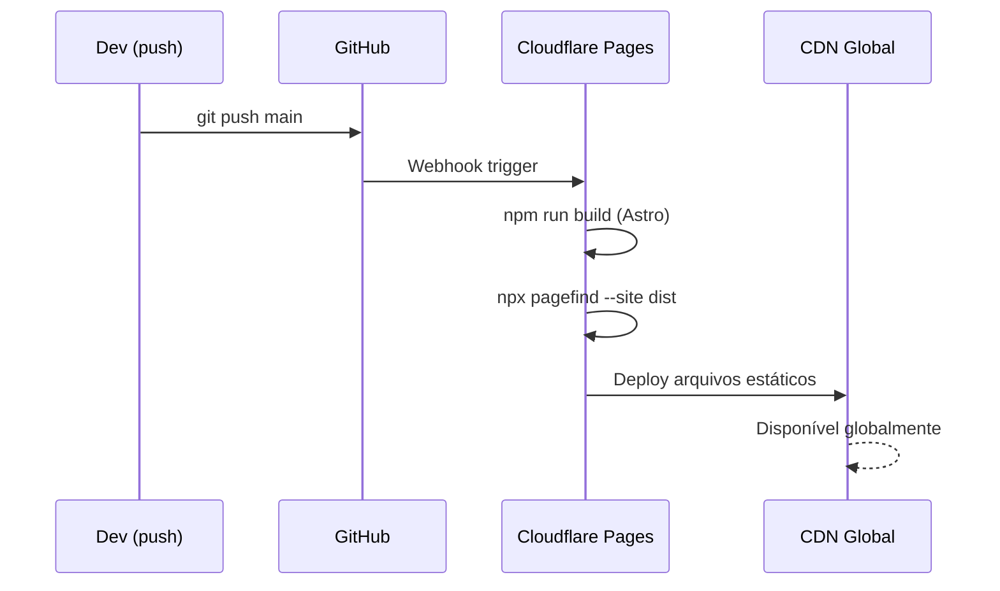
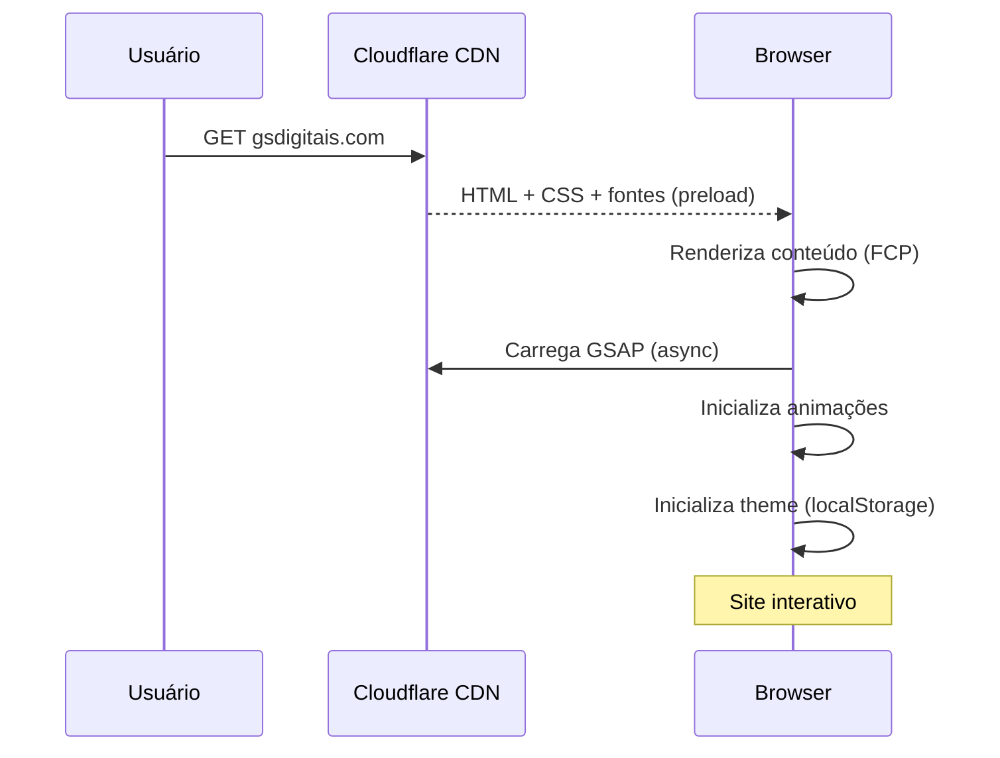
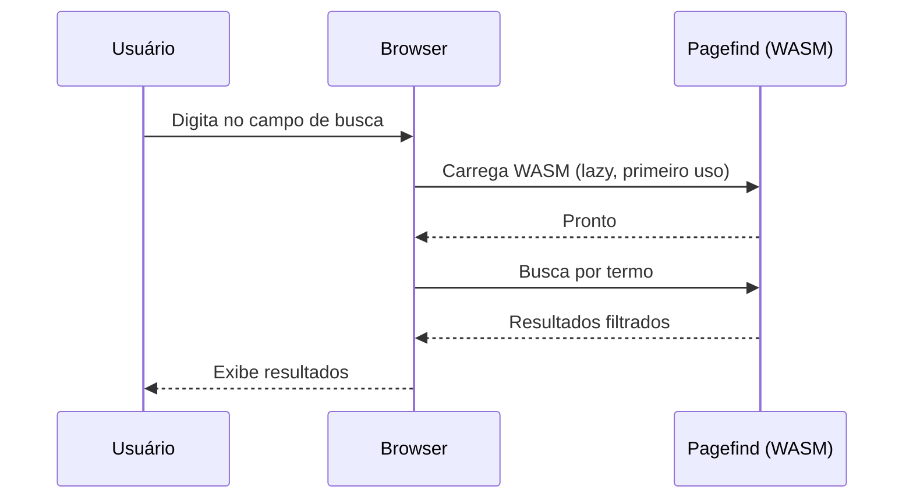
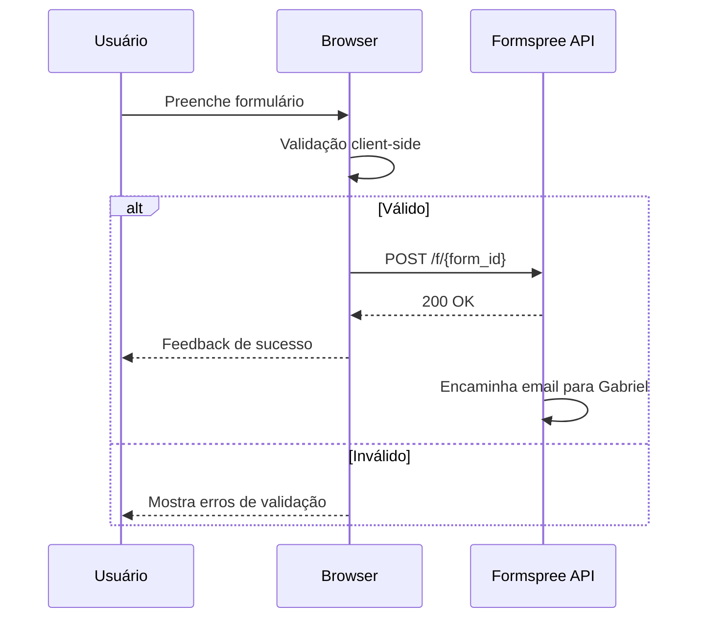
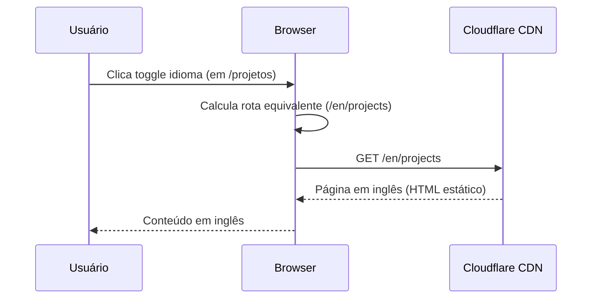
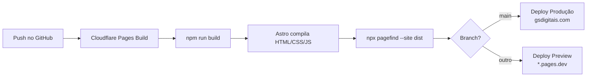

# ARCHITECTURE.md — Portfólio Pessoal (gsdigitais.com)

**Versão:** 1.0  
**Última atualização:** 17/03/2026

---

## 1. Visão Geral

Site estático bilíngue gerado com Astro, servido via Cloudflare Pages CDN. Não há backend — todo conteúdo é compilado em HTML/CSS/JS no build. Conteúdo dinâmico (blog, case studies) vive em arquivos MDX processados no build. Interatividade client-side é limitada a: dark mode toggle, language toggle, busca no blog (Pagefind), formulário de contato (Formspree), animações (GSAP), e cursor customizado.

**Tipo de arquitetura:** Site estático com ilhas de interatividade (Astro Islands)

### Diagrama geral



---

## 2. Componentes

### 2.1 Astro (Framework / Build)

| Aspecto | Detalhe |
|---------|---------|
| **Responsabilidade** | Gerar HTML estático a partir de componentes, layouts e conteúdo MDX |
| **Tecnologia** | Astro 5.x com TypeScript |
| **Localização** | `src/pages/`, `src/layouts/`, `src/components/` |
| **Comunica com** | Content Collections (MDX), sistema i18n (JSON), Tailwind (CSS) |
| **Estado** | Sem estado server-side — tudo é estático. Estado client-side mínimo via scripts |

### 2.2 Content Collections (MDX)

| Aspecto | Detalhe |
|---------|---------|
| **Responsabilidade** | Armazenar e tipar conteúdo estruturado (blog posts, case studies) |
| **Tecnologia** | Astro Content Collections + @astrojs/mdx |
| **Localização** | `src/content/blog/`, `src/content/projects/` |
| **Schema** | Definido em `src/content/config.ts` com Zod |
| **Multilíngue** | Arquivos separados por locale: `index.pt-br.mdx`, `index.en.mdx` |

### 2.3 Sistema de i18n

| Aspecto | Detalhe |
|---------|---------|
| **Responsabilidade** | Fornecer strings traduzidas para toda a UI |
| **Tecnologia** | Implementação custom (sem lib externa) |
| **Localização** | `src/i18n/` |
| **Estratégia de rotas** | PT-BR na raiz (`/`), EN com prefixo (`/en/`) |
| **Detecção de idioma** | Pela rota (não por header Accept-Language) |

### 2.4 GSAP (Animações)

| Aspecto | Detalhe |
|---------|---------|
| **Responsabilidade** | Animações de scroll, page transitions, parallax, cursor customizado |
| **Tecnologia** | GSAP 3.12+ com plugin ScrollTrigger |
| **Localização** | `src/scripts/animations.ts`, `src/scripts/cursor.ts`, `src/components/animations/` |
| **Carregamento** | Script carregado após DOM ready, não bloqueia renderização |
| **Acessibilidade** | Respeita `prefers-reduced-motion` — animações desabilitadas se ativo |
| **Mobile** | Parallax e cursor customizado são desktop-only (feature detection) |

### 2.5 Pagefind (Busca)

| Aspecto | Detalhe |
|---------|---------|
| **Responsabilidade** | Busca full-text nos posts do blog |
| **Tecnologia** | Pagefind 1.x (WebAssembly) |
| **Localização** | Índice gerado em `dist/pagefind/`, UI em `src/components/blog/SearchBar.astro` |
| **Build step** | `npx pagefind --site dist` roda após o build do Astro |
| **Multilíngue** | Indexa conteúdo em ambos os idiomas, filtra por locale na busca |
| **Peso** | ~50KB WASM + índice (proporcional ao conteúdo) |

### 2.6 Formspree (Formulário de Contato)

| Aspecto | Detalhe |
|---------|---------|
| **Responsabilidade** | Receber mensagens do formulário e encaminhar por email |
| **Tecnologia** | Formspree API (externo) |
| **Localização** | `src/components/contact/ContactForm.astro` |
| **Integração** | POST via fetch para endpoint Formspree |
| **Validação** | Client-side (HTML5 + JS) antes de enviar |
| **Anti-spam** | Honeypot field do Formspree |

### 2.7 Cloudflare Pages (Hosting)

| Aspecto | Detalhe |
|---------|---------|
| **Responsabilidade** | Servir o site estático globalmente |
| **Tecnologia** | Cloudflare Pages + Workers (analytics) |
| **Domínio** | gsdigitais.com (raiz) |
| **Build** | Conectado ao GitHub, build automático no push |
| **Preview** | Preview deploys por branch/PR |

---

## 3. Fluxo de Dados

### Fluxo 1 — Build e deploy



### Fluxo 2 — Usuário navega o site



### Fluxo 3 — Busca no blog



### Fluxo 4 — Envio de formulário



### Fluxo 5 — Troca de idioma



---

## 4. Sistema de Internacionalização (i18n)

### Arquitetura

```
src/i18n/
├── config.ts        # Configuração: locales, defaultLocale, rotas
├── pt-br.json       # Todas as strings PT-BR
├── en.json          # Todas as strings EN
└── utils.ts         # Funções helper
```

### Config

```typescript
// src/i18n/config.ts
export const defaultLocale = 'pt-br' as const;
export const locales = ['pt-br', 'en'] as const;
export type Locale = (typeof locales)[number];

// Mapeamento de rotas entre idiomas
export const routeMap: Record<string, Record<Locale, string>> = {
  '/': { 'pt-br': '/', 'en': '/en/' },
  '/projetos': { 'pt-br': '/projetos', 'en': '/en/projects' },
  '/projetos/[slug]': { 'pt-br': '/projetos/[slug]', 'en': '/en/projects/[slug]' },
  '/blog': { 'pt-br': '/blog', 'en': '/en/blog' },
  '/blog/[slug]': { 'pt-br': '/blog/[slug]', 'en': '/en/blog/[slug]' },
  '/sobre': { 'pt-br': '/sobre', 'en': '/en/about' },
  '/uses': { 'pt-br': '/uses', 'en': '/en/uses' },
  '/contato': { 'pt-br': '/contato', 'en': '/en/contact' },
};
```

### Helpers

```typescript
// src/i18n/utils.ts
export function getLang(url: URL): Locale;           // Detecta idioma pela URL
export function t(key: string, locale: Locale): string; // Busca tradução
export function getLocalizedPath(path: string, locale: Locale): string; // Converte rota
export function getAlternateLang(locale: Locale): Locale; // pt-br → en, en → pt-br
```

### Estrutura dos arquivos de tradução

```json
// src/i18n/pt-br.json
{
  "nav": {
    "home": "Início",
    "projects": "Projetos",
    "blog": "Blog",
    "about": "Sobre",
    "uses": "Uses",
    "contact": "Contato"
  },
  "home": {
    "headline": "Dados, marketing e código — tudo ao mesmo tempo.",
    "bio": "...",
    "projectsTitle": "Projetos",
    "blogTitle": "Blog",
    "ctaContact": "Entre em contato"
  },
  "blog": {
    "searchPlaceholder": "Buscar posts...",
    "readingTime": "{minutes} min de leitura",
    "allTags": "Todas as categorias",
    "noResults": "Nenhum post encontrado."
  },
  // ... demais seções
}
```

### Regras de i18n

1. **Strings de UI** → sempre via `t('chave', locale)`, nunca hardcoded
2. **Conteúdo MDX** → arquivo separado por idioma (`index.pt-br.mdx`, `index.en.mdx`)
3. **Rotas** → nomes traduzidos (`/projetos` vs `/en/projects`)
4. **SEO** → tags `hreflang` em todas as páginas, meta tags no idioma correto
5. **Posts monolíngues** → se um post só existe em PT-BR, a versão EN mostra aviso com link pro original
6. **Datas** → formatadas conforme locale (`15 de março de 2026` vs `March 15, 2026`)

---

## 5. Sistema de Blog

### Content Collection Schema

```typescript
// src/content/config.ts
import { defineCollection, z } from 'astro:content';

const blogCollection = defineCollection({
  type: 'content',
  schema: z.object({
    title: z.string(),
    description: z.string(),
    date: z.date(),
    updatedDate: z.date().optional(),
    tags: z.array(z.string()),
    locale: z.enum(['pt-br', 'en']),
    draft: z.boolean().default(false),
    image: z.string().optional(),        // OG image
    imageAlt: z.string().optional(),
  }),
});

const projectCollection = defineCollection({
  type: 'content',
  schema: z.object({
    title: z.string(),
    description: z.string(),
    date: z.date(),
    locale: z.enum(['pt-br', 'en']),
    stack: z.array(z.string()),
    liveUrl: z.string().url(),
    githubUrl: z.string().url(),
    image: z.string(),                   // Screenshot principal
    imageAlt: z.string(),
    featured: z.boolean().default(false),
    order: z.number(),                   // Ordem de exibição
  }),
});

export const collections = {
  blog: blogCollection,
  projects: projectCollection,
};
```

### Funcionalidades do blog

| Feature | Implementação |
|---------|--------------|
| **Listagem** | Página com todos os posts, ordenados por data (mais recente primeiro) |
| **Tags/Categorias** | Extraídas do frontmatter, com páginas de filtro por tag |
| **Busca** | Pagefind (client-side, WebAssembly, indexação no build) |
| **Tempo de leitura** | Calculado no build a partir do word count do MDX |
| **Navegação** | Links anterior/próximo no rodapé de cada post |
| **Code blocks** | Syntax highlighting via Shiki (built-in no Astro) |
| **MDX components** | Callouts, imagens com caption, embeds customizados |
| **RSS** | Feed RSS gerado automaticamente (um por idioma) |
| **Draft mode** | Posts com `draft: true` não são publicados no build |

---

## 6. Sistema de Animações

### Estratégia

```
Animações são divididas em 3 camadas:

1. CSS Transitions (leve, sempre)
   → Hover states, focus states, color transitions (dark mode)
   → Não precisa de JS, não impacta performance

2. GSAP ScrollTrigger (médio, scroll-dependent)
   → Elementos que aparecem no scroll (fade, slide, scale)
   → Parallax em seções selecionadas
   → Timeline de carreira animada

3. GSAP Core (pesado, interação contínua)
   → Cursor customizado (desktop only)
   → Page transitions (navegação entre páginas)
   → Efeitos especiais na hero section
```

### Componentes de animação

```
src/components/animations/
├── ScrollReveal.astro    # Wrapper que anima filhos ao entrar no viewport
├── Parallax.astro        # Wrapper de parallax (desktop only)
├── PageTransition.astro  # Transição entre páginas
└── CustomCursor.astro    # Cursor customizado (desktop only)

src/scripts/
├── animations.ts         # Inicialização global do GSAP + ScrollTrigger
├── cursor.ts             # Lógica do cursor customizado
└── theme.ts              # Dark/light mode com transição suave
```

### Regras de animação

1. **`prefers-reduced-motion: reduce`** → desabilita TODAS as animações GSAP, mantém só transições CSS essenciais (color, opacity para dark mode)
2. **Mobile (< 1024px)** → sem parallax, sem cursor customizado, scroll animations simplificadas
3. **Performance budget** → nenhuma animação pode aumentar TBT (Total Blocking Time) acima de 200ms
4. **Loading** → GSAP carregado async/defer, não bloqueia FCP
5. **Cleanup** → ScrollTrigger.kill() em todos os triggers ao mudar de página (evitar memory leaks)

### Exemplos de efeitos planejados

| Elemento | Efeito | Desktop | Mobile |
|----------|--------|---------|--------|
| Hero headline | Typewriter ou split text animation | ✅ | ✅ (simplificado) |
| Cards de projeto | Scale + shadow on hover | ✅ | Touch feedback simples |
| Seções ao scroll | Fade-up com stagger | ✅ | ✅ (fade simples) |
| Hero background | Parallax sutil | ✅ | ❌ (estático) |
| Cursor | Dot que segue + grow on hover | ✅ | ❌ (cursor nativo) |
| Page transitions | Fade/slide entre páginas | ✅ | ✅ (fade rápido) |
| Timeline | Itens aparecem sequencialmente | ✅ | ✅ |

---

## 7. Sistema de Dark Mode

### Implementação

```typescript
// src/scripts/theme.ts (pseudocódigo)

// 1. Verificar preferência salva (localStorage)
// 2. Se não houver, usar prefers-color-scheme do sistema
// 3. Aplicar classe 'dark' no <html>
// 4. Persistir escolha no localStorage ao usar toggle
// 5. Transição suave via CSS transition em background-color e color
```

### Estratégia anti-flash (FOUC)

```html
<!-- Inline script no <head> (antes de qualquer CSS) -->
<script is:inline>
  const theme = localStorage.getItem('theme') ||
    (window.matchMedia('(prefers-color-scheme: dark)').matches ? 'dark' : 'light');
  document.documentElement.classList.toggle('dark', theme === 'dark');
</script>
```

### CSS

```css
/* Tailwind dark mode via class strategy */
/* tailwind.config.mjs: darkMode: 'class' */

/* Todas as cores usam CSS custom properties */
/* A classe .dark no <html> altera os valores das custom properties */
```

---

## 8. SEO e Meta Tags

### Estrutura

```typescript
// src/utils/seo.ts

interface SEOProps {
  title: string;
  description: string;
  locale: Locale;
  image?: string;
  type?: 'website' | 'article';
  publishedTime?: string;
  tags?: string[];
}

// Gera: <title>, <meta description>, Open Graph, Twitter Card,
// hreflang alternates, canonical URL, JSON-LD
```

### JSON-LD

```json
// Homepage: Person schema
{
  "@context": "https://schema.org",
  "@type": "Person",
  "name": "Gabriel Alves de Souza",
  "url": "https://gsdigitais.com",
  "jobTitle": "Data Analyst",
  "sameAs": [
    "https://linkedin.com/in/biel-als/",
    "https://github.com/galvza"
  ]
}

// Blog posts: BlogPosting schema
{
  "@context": "https://schema.org",
  "@type": "BlogPosting",
  "headline": "...",
  "datePublished": "...",
  "author": { "@type": "Person", "name": "Gabriel Alves de Souza" }
}
```

---

## 9. Integrações Externas

### Formspree

| Aspecto | Detalhe |
|---------|---------|
| **Documentação** | https://formspree.io/docs |
| **Autenticação** | Nenhuma (form ID público, protegido por domínio) |
| **Endpoint** | `POST https://formspree.io/f/{FORM_ID}` |
| **Formato** | JSON ou FormData |
| **Anti-spam** | Honeypot field (`_gotcha`) + verificação de domínio |
| **Rate limit** | 50 submissões/mês no plano grátis |
| **Variável** | `FORMSPREE_ENDPOINT` |

### Plausible Analytics (self-hosted)

| Aspecto | Detalhe |
|---------|---------|
| **Documentação** | https://plausible.io/docs/self-hosting |
| **Hospedagem** | Cloudflare Worker que faz proxy do script + coleta de eventos |
| **Script** | `<script defer data-domain="gsdigitais.com" src="{WORKER_URL}/js/script.js"></script>` |
| **Eventos custom** | `plausible('event_name', { props: { key: 'value' } })` |
| **Eventos planejados** | Clique em projeto, clique em contato, troca de idioma, troca de tema |
| **Privacidade** | Sem cookies, sem dados pessoais, compatível com LGPD/GDPR |

---

## 10. Decisões Técnicas

### DT-01: Astro sobre Next.js

| Aspecto | Detalhe |
|---------|---------|
| **Decisão** | Usar Astro 5.x como framework |
| **Alternativas** | Next.js 14, Hugo, Eleventy |
| **Motivo** | Site de conteúdo estático — Astro gera zero JS por padrão, performance imbatível. Next.js seria overkill (sem necessidade de SSR, API routes, ou React pesado). Content Collections do Astro são perfeitas pro blog MDX. |
| **Consequências** | Interatividade requer ilhas explícitas (bom — força a ser intencional com JS) |

### DT-02: GSAP sobre Framer Motion

| Aspecto | Detalhe |
|---------|---------|
| **Decisão** | Usar GSAP + ScrollTrigger pra animações |
| **Alternativas** | Framer Motion, CSS puro, Motion One |
| **Motivo** | GSAP é o padrão da indústria pra sites Awwwards. ScrollTrigger é a melhor solução de scroll-triggered animations. Funciona com vanilla JS (não precisa de React/ilhas). Framer Motion exigiria ilhas React em todo componente animado. |
| **Consequências** | Peso adicional (~70KB), mas carregado async e justificado pelo nível de animação desejado |

### DT-03: Pagefind sobre Fuse.js

| Aspecto | Detalhe |
|---------|---------|
| **Decisão** | Usar Pagefind pra busca no blog |
| **Alternativas** | Fuse.js, Lunr.js, Algolia |
| **Motivo** | Feito pra sites estáticos, indexa no build, busca via WASM (rápido), suporte multilíngue nativo, usado pela comunidade Astro. Fuse.js exigiria montar index manual e degrada com volume. |
| **Consequências** | Dependência de post-build step (pagefind CLI) |

### DT-04: Space Grotesk + Inter

| Aspecto | Detalhe |
|---------|---------|
| **Decisão** | Space Grotesk (headlines) + Inter (body) + JetBrains Mono (code) |
| **Alternativas** | Syne, Clash Display, system fonts |
| **Motivo** | Space Grotesk é geométrica, bold e séria — combina com a identidade P&B dramática. Inter é a melhor fonte de body text pra telas. JetBrains Mono é o padrão dev. Todas são open source e self-hostable. |
| **Consequências** | Peso de fontes (~150KB total com subsets). Mitigado por preload, font-display: swap, e subset só dos caracteres usados. |

### DT-05: i18n custom sobre astro-i18next

| Aspecto | Detalhe |
|---------|---------|
| **Decisão** | Implementar i18n com código próprio (JSON + helpers) |
| **Alternativas** | astro-i18next, astro-i18n-aut, paraglide |
| **Motivo** | O escopo é simples (2 idiomas, strings estáticas). Uma lib adicionaria complexidade e dependência desnecessárias. A implementação custom é ~100 linhas de código, zero dependências, total controle. |
| **Consequências** | Sem features avançadas (pluralização, interpolação complexa). Não precisamos disso. |

### DT-06: Formspree sobre implementação própria

| Aspecto | Detalhe |
|---------|---------|
| **Decisão** | Usar Formspree para formulário de contato |
| **Alternativas** | Cloudflare Worker custom, Netlify Forms, emailjs |
| **Motivo** | Zero backend, setup em 5 minutos, honeypot anti-spam incluso, 50 submissões/mês grátis (suficiente). Não justifica criar Worker custom pra isso. |
| **Consequências** | Dependência externa (Formspree), limite de 50/mês no grátis |

### DT-07: Self-hosted fonts sobre Google Fonts CDN

| Aspecto | Detalhe |
|---------|---------|
| **Decisão** | Baixar fontes e servir de /public/fonts/ |
| **Alternativas** | Google Fonts CDN, Fontsource |
| **Motivo** | Privacidade (sem requests pra Google), performance (fontes no mesmo CDN do site, preload eficiente), controle (subset exato dos caracteres necessários). |
| **Consequências** | Precisa gerar subsets manualmente (ou usar ferramenta como glyphhanger) |

---

## 11. Infraestrutura e Deploy

### Ambientes

| Ambiente | URL | Hospedagem | Branch |
|----------|-----|-----------|--------|
| Desenvolvimento | localhost:4321 | Local (Astro dev server) | qualquer |
| Preview | [auto-gerada].pages.dev | Cloudflare Pages Preview | PRs e branches |
| Produção | gsdigitais.com | Cloudflare Pages | main |

### Pipeline de deploy



### Build command

```bash
npm run build && npx pagefind --site dist
```

### Variáveis de ambiente por ambiente

| Variável | Dev | Preview | Produção |
|----------|-----|---------|----------|
| SITE_URL | http://localhost:4321 | [preview-url] | https://gsdigitais.com |
| FORMSPREE_ENDPOINT | [form de teste] | [form de teste] | [form real] |
| PLAUSIBLE_DOMAIN | — | — | gsdigitais.com |

---

## 12. Segurança

- [x] Variáveis sensíveis em .env (Formspree endpoint)
- [x] Sem banco de dados (zero superfície de ataque)
- [x] Sem autenticação (site público)
- [x] HTTPS via Cloudflare (automático)
- [x] Formulário com honeypot anti-spam (Formspree)
- [x] Validação client-side no formulário
- [x] Content Security Policy headers via Cloudflare
- [x] X-Frame-Options: DENY
- [x] X-Content-Type-Options: nosniff
- [x] Referrer-Policy: strict-origin-when-cross-origin
- [x] Sem dependências de runtime externas além de Formspree e Plausible

---

## 13. Performance Budget

| Métrica | Limite | Como garantir |
|---------|--------|---------------|
| Lighthouse Performance | ≥ 90 | Astro zero-JS, lazy loading, image optimization |
| First Contentful Paint | < 1.5s | Font preload, inline critical CSS |
| Largest Contentful Paint | < 2.5s | Image optimization (sharp), srcset |
| Total Blocking Time | < 200ms | GSAP async, minimal JS |
| Cumulative Layout Shift | < 0.1 | Font-display: swap, dimensões de imagem explícitas |
| JS bundle total | < 100KB (gzipped) | GSAP (~25KB gz) + Pagefind (~15KB gz) + scripts (~10KB gz) |
| Font weight total | < 150KB | Subsets, apenas pesos necessários |

---

## 14. Limitações Conhecidas

| # | Limitação | Motivo | Impacto |
|---|-----------|--------|---------|
| L01 | Formulário de contato limitado a 50 submissões/mês | Plano gratuito do Formspree | Upgrade se necessário ($10/mês) |
| L02 | Busca não funciona sem JavaScript | Pagefind usa WASM | Poucos usuários sem JS, aceitável |
| L03 | Animações GSAP não funcionam sem JavaScript | Natureza da lib | Site funciona sem animações (progressive enhancement) |
| L04 | Preview deploys não têm analytics | Plausible configurado só pro domínio real | Sem impacto (é o comportamento desejado) |
| L05 | Posts monolíngues não têm versão alternativa | Decisão de conteúdo, não técnica | Mostra aviso "disponível apenas em [idioma]" |
| L06 | Cursor customizado não funciona em touch devices | Não existe cursor em mobile/tablet | Graceful degradation — cursor padrão do sistema |
